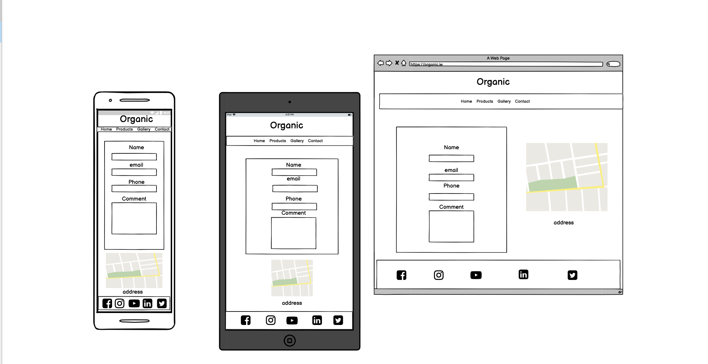
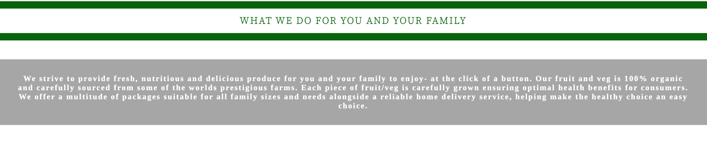

# ORGANIC
(Developer: Martin Brilly)

[Live Webpage](https://martinmib.github.io/organic/)

## Table of Content

1. [Project Goals](#project-goals)
    1. [User Goals](#user-goals)
    2. [Site Owner Goals](#site-owner-goals)
2. [User Experience](#user-experience)
    1. [Target Audience](#target-audience)
    2. [User Requrements and Expectations](#user-requrements-and-expectations)
    3. [User Stories](#user-stories)
3. [Design](#design)
    1. [Design Choices](#design-choices)
    2. [Colour](#colours)
    3. [Fonts](#fonts)
    4. [Structure](#structure)
    5. [Wireframes](#wireframes)   
4. [Technologies Used](#technologies-used)
    1. [Languages](#languages)
    2. [Frameworks & Tools](#frameworks-&-tools)  
5. [Features](#features)
6. [Testing](#validation)
    1. [HTML Validation](#HTML-validation)
    2. [CSS Validation](#CSS-validation)
    3. [Accessibility](#accessibility)
    4. [Performance](#performance)
    5. [Device testing](#performing-tests-on-various-devices)
    6. [Browser compatibility](#browser-compatability)
    7. [Testing user stories](#testing-user-stories)
8. [Bugs](#Bugs)
9. [Deployment](#deployment)
10. [Credits](#credits)
11. [Acknowledgements](#acknowledgements)

## Project Goals 
Design a site which is  
- simple to use
- bright and colorful naturally ( both with color choice and image options)
- has four pages
- fully acessability 

### User Goals 
The user goals 
- to be able to navigate the site easy 
- to be informed of what the website (company) offers
- to be informed of how the website(company) operates and delivers 
- list a standard product list to give customer a guideline on the structure of products available 

### Site Owner Goals
- list a standard product list to give customer a guideline on the structure of products available 
- explain that you have to sign up to get an updated product list with up to date prices as the price of foodstuff is increasing and doesnt leave the company at a loss of earnings on a human error.
- An updatable gallery with the option of hover image enlarge and click to view larger on a preview window
- have a sign up page which gives the company an extra advantage at reaching new customer through marketed email 
- have social media icons which direect back to the company's social media sites
- explain that you have to sign up to get an updated product list with up to date prices as the price of foodstuff is increasing and doesnt leave the company at a loss of earnings on a human error

## User Experience

### Traget Audience
As the food industry is a very vast market the target audience would consist of 
- Families
- Businesses offices 
- individual that want a specific cost on their weekly shop

### User Requirments and Expectations
- A site that is simple and inuitive to use 
- Explanation of what the company provides and how
- A fully functional website 
- An easy way to get in contact to recieve up to date order sheet
- Quality presentation

### User Stories

#### First-time User

1. As a first time user, I want to be able to navigate the site easily
2. As a first time user, I want to understand how the company works
3. As a first time user, I want to be able to contact the company 
4. As a first time user, I want to be able to view some of the products 

#### Returning User

5. As a returning user, I want to be able to jump directly onto the companys social pages
6. As a returning user, I want to find the companies location easy with option of gps 
7. As a returning user, I want to save time on having to look at different menus or products which is why we chose to sign up for the weekly email
8. As a returning user, I want to be able to order easy i dont want to have to input details each time 

#### Site Owner

9. As a site owner, I want the site to be bright and follow the organic thought
10. As a site owner, I want the site to gather as many contact emails as possible 
11. As a site owner, I want the site to show customers gallery images of individual fruits and juices which we use for the final prodcuts
12. As a site owner, I want the site to show our town location because we dont operate a shop front

## Design

### Design Choices

The design of the site is a bright colorful site which is done through imagry , that has a simple text disply for logo, nav bar , footer with selected content in each page with a white background on selected spaces to amplify the imagry. 
On the index.html page there is a grey opacity with the color rgba(0,0,0,0.35) just to bounce out the text and imagry

### Color

- Dark Green
- White
- backgroound shade of rgba(0,0,0,0.35)

All colours above were used as simple and basic colors on the basis of keeping it as close to the general relation of the meaning of the word organic.

Organic Wikipediea Meaning and understanding 

Dark Green Colour 

### Fonts

Logo:
font-family: 'Cormorant Infant', serif;: 

I used the cormorant infant font, with a backup of serif. I liked the slim simple design on the basis that i dint want to overcrowd the navigation bar on the understanding of the placement of the a selectors being underneath 

### H1,H2:

font-family: 'Source Serif Pro', serif;

The headings used the 'Source Serif Pro' font, with a backup of serif. The slim design was neat and simple. Probably could be thicker for hard of sight

### P:

The paragraphs used the font-family: 'Tinos', serif; */ i think it stands out maybe a little too much but it is easily read

### Structure

. Home page (which has a nav bar and logo which is simply laid out easy to use, a footer with all social links and information on the fruit, what we do and how we do it)
.Products page (which has an arraw of products from fruit boxes to cold pressed juices)
. Gallery page ( which has an array of images that float out and have the option of a full size image on click to view in a preview window)
- Contact page ( which has a name, email,phone no, and comments section)

### Wireframes

Home

Products

Gallery

Contact

## Technologies Used

### Languages

- HTML
- CSS

### Frameworks & Tools
- Git pod
- Git hub
- Git
- amiresponsive
- Balsamiq
- istockphoto
- developers.google.com
- Font Awsome 
- Google Fonts
- Adobe Photoshop images

## Features
The site consisist of four pages and 11 features 

### Logo and Navigation Bar

- The navagation bar and logo is placed on all four pages
- The navbar is responsive
- Very straight forward menu 
- User stories covered: 1,9

Navbar-logo

### Some of the fruit we use 

- A selection of indiviual fruits
- User stories covered: 4,7, 11

Selection of Fruit

### What we do 

- Explanation of the service provided
- User stories covered: 2 

What We Do

### How we do it 

- Simple icon and paragraph with details of the process of ordering and delivery
- User stories covered: 2,

How We Do

### Footer

- Selection of links for social media 
- User stories covered: 5, 9 

Footer

### Products
- Product listing of various example products
- User stories covered: 4,7,9

Products

### Gallery
- Galley of the companies fruit and past products
- User stories covered: 4,7,9

Gallery

### Contact
- Contact form fully operational
- User stories covered: 3, 7, 8, 10

contact

### Map 
- Map with town location 
- User stories covered:  6,12

Map

## Validation 

### HTML Validation
The wc3 Markup Validation Service is the online sevice that was used  

Home

Products

Gallery

Contact

### CSS Validation 

The w3c Jigsaw Css Validation Serice is the online service that was used

### Accessibility 

The WAve WebAim Web accessibility evaluation tool is the online service that was used. It came back with re occuring errors one 5 being no text in the icons on the footer.
4 being contrast issues with the navbar text color of white because of where it is located.
1 alert of home or index link redundant because it is used already in the logo not sure why

Home

Updated

Home

Products

Updated 

Products

Gallery

Updated

Gallery

Contact

Updated

Contact

### Performance 

Google Lighthouse in Google Chrome dev tools was the online servie that was used 

Home

Updated

Home

Products

Updated

Products

Gallery

Updated 

Gallery

Contact

Updated

Contact

### Performing tests on various devices 
 The website was tested on the following devices:
  - Apple Macbook Pro 15inch 
  - Apple MacAir 13inch 
  - Apple I Pad 10 

    All operating on safari 

### Browser Compatability 
The websites were tested on the following browsers:
- Google Chrome 
- Brave
- Safari

### Testing user stories 

#### First-time User

1. As a first time user, I want to be able to navigate the site easily

**Feature**
Navbar

**Action**
Use Navigation Bar

**Expected Result**
For all navigation buttons to work 

**Actual Result**

Everything works as it should 

2. As a first time user, I want to understand how the company works

**Feature**
Home Page

**Action**
Scroll down the page 

**Expected Result**
Page to Scroll
 

**Actual Result**
Page Scrolls to selected area

3. As a first time user, I want to be able to contact the company

**Feature**
Contact Form

**Action**
Click Contact on navbar and brings yout to contact page
Fill in form with all details

**Expected Result**
Fully operational contact form 

**Actual Result**
Works as expected

4. As a first time user, I want to be able to view some of the products

**Feature**
Product page

**Action**
Click products on navigation bar

**Expected Result**
Listing of products on a selected page
 

**Actual Result**
Works as expected

#### Returning User

feature-homepage

5. As a returning user, I want to be able to jump directly onto the companys social pages

**Feature**

**Action**

**Expected Result**
 

**Actual Result**

feature-homepage

6. As a returning user, I want to find the companies location easy with option of gps 

**Feature**
Map

**Action**
Click navigation bar scroll down the page to map and search

**Expected Result**
 Town Location

**Actual Result**
Works as expected

7. As a returning user, I want to save time on having to look at different menus or products which is why we chose to sign up for the weekly email

**Feature**
Contact 

**Action**
All included in the weekly sign up email 

**Expected Result**
Save time and browsing 
 
**Actual Result**
On expected recieving of email works as ment to 

feature-homepage

8. As a returning user, I want to be able to order easy i dont want to have to input details each time 

**Feature**
Contact 

**Action**
when all your details are input the company has your email which gives an updated menu weekly

**Expected Result**
customer recieves upto date details
 
**Actual Result**
future aspect 

#### Site Owner
9. As a site owner, I want the site to be bright and follow the organic thought

**Feature**
Visual 

**Action**
Selection of different images on various pages

**Expected Result**
Bright Visuals 
 
**Actual Result**
Works as expected 

10. As a site owner, I want the site to gather as many contact emails as possible 

**Feature**
Contact Form

**Action**
Click Contact on the navigation bar and scroll down to contact to input the information 

**Expected Result**
return to home page after input is completly filled out
  
**Actual Result**
Works as expected 

11. As a site owner, I want the site to show customers gallery images of individual fruits and juices which we use for the final prodcuts

**Feature**
Gallery 

**Action**
Click Gallery on navigation bar

**Expected Result**
A selection of hoverable images with the option of a larger image
 
**Actual Result**
Works as expected 

12. As a site owner, I want the site to show our town location because we dont operate a shop front

**Feature**
Map
**Action**
Click Contact on the navigation bar and scroll down 

**Expected Result**
Map to show town location
 
**Actual Result**
works as expected

## Bugs 

1. 15th may deleted most work to try again as it is not doing what i want it to do. 

2. restarted by cleaning up what i dont need 

3. add header and logo structured into position
cleared css and html head media wouldnt adjust kept going from full screen to hlf white hlf green

4. eleted css to understand it better and so my code wasnt copying
kept the js file not a dickey on how it works yet 

5. ran into an issue placing the images in the fruit images 

6. got them in no problem after just aligning but still not centering properly 

7. ran html and css validators to have very little bugs  few  , , , in places they shouldnt and one open div that if i close it takes the picture from the index html backgound.
 

8. gitpod /workspace/organic (main) $ git commit -m "restructured css back to mobile view" 
[main 31e4a0b] restructured css back to mobile view
 3 files changed, 228 insertions(+), 189 deletions(-)
 rewrite index.html (61%)

9. redone the site from mobile up to only have it not working 
10. tidy up the site from any marginal errors 

## Future adds and fixes 

1. Fix any errors find a soloution
2. Add Chat bot with ordering possabilities 
3. Add Hamburger menu
4. Sort out accessibility
5. Work out why the performance is low on certain pages

## Deployment

The website was deployed using GitHub Pages by following these steps:
1. In the GitHub repository navigate to the settings tab
2. On the left hand menu select Pages
3. For the source select Branch: master
4. After the webpage refreshes automaticaly you will se a ribbon on the top saying: "Your site is published at https://martinmib.github.io/organic/

Forking the repository by following these steps:
1. Go to the GitHub repository
2. Click on Fork button in upper right hand corner

Cloning the repository by following these steps:
1. Go to the GitHub repository 
2. Locate the Code button above the list of files and click it 
3. Select if you prefere to clone using HTTPS, SSH, or Github CLI and click the copy button to copy the URL to your clipboard
4. Open Git Bash
5. Change the current working directory to the one where you want the cloned directory
6. Type git clone and paste the URL from the clipboard ($ git clone https://github.com/YOUR-USERNAME/YOUR-REPOSITORY)
7. Press Enter to create your local clone.

## Credits

### Media

My images cames from two sites

1. Adobe Photo Shop 
2. IStock Photos
3. 100forms.com

### Code

1. navbar i watched https://code-boxx.com/simple-responsive-pure-css-hamburger-menu/ to get the idea for a hamburger menu but have to come back to it to implement it into the site 

2. Contact . I used the contact form from a site called iforms 

3. Map . i got the details on how to add from https://www.youtube.com/watch?v=4U_AAGHzTok
4. Read me template was used as a guideline  

from 4n4ru/CI_MS1_BodelschwingherHof
5. Code for email form https://www.100forms.com

## Acknowledgments
I would like to thank 
- My mentor Mo Shami for the final push and his guidence and direction
- My kids and fiance for not disowning me in my times of needed silence
- Code institue and the very very helpful guy named ed
- The universe for just being